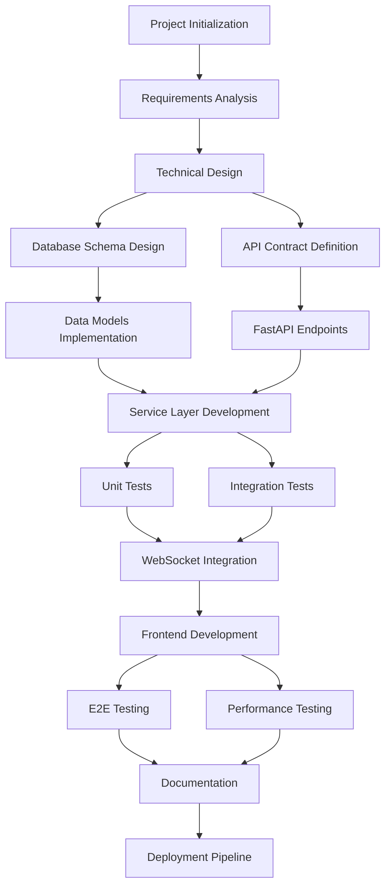

# Cards Against AI - Project Specifications

## Development Workflow

## Technical Stack
- Backend: Python with FastAPI
- Database: SQLite
- Frontend: React with Vite
- Language: TypeScript
- External Services: Anthropic API, Redis

## Design Principles
- Follow 12-factor app principles
- Simplicity over complexity
- DRY when it matters
- Comprehensive documentation
- Docker and Docker Compose for simplification
- Makefile for common operations

## Key Learnings

### 1. Importance of Detailed Specifications
Having a clear and detailed specification document is crucial for guiding the implementation process and ensuring all requirements are met.

### 2. Iterative Development
The process of implementing, reviewing, and refining the codebase highlighted the importance of iterative development in catching and correcting inconsistencies.

### 3. Integration Challenges
Integrating multiple services (database, Redis, Anthropic API) requires careful planning and error handling to ensure robust operation.

### 4. Testing Complexities
Mocking external services, especially newer APIs like Anthropic, can be challenging and requires a good understanding of the service's behavior.

### 5. Alignment of API, Services, and Data Models
Ensuring consistency between the API endpoints, service implementations, and data model is crucial for a coherent system.

### 6. Modular Design
The modular design of services (Game, Card, AI, Redis) proved beneficial for organizing the codebase and separating concerns.

### 7. Flexibility in API Design
Be prepared to adjust API endpoints and service methods as the implementation progresses and requirements become clearer.

### 8. Importance of Schemas
Well-defined schemas are crucial for maintaining consistency between the API, services, and data model.

### 9. Mocking External Services
When working with external APIs, invest time in creating accurate mocks to facilitate testing.

## Areas for Improvement

### 1. Initial Planning
More time could have been spent on initial planning to better align the implementation with the specifications from the start.

### 2. Documentation
Earlier and more comprehensive documentation of the API endpoints and service functionalities could have prevented some inconsistencies.

### 3. Error Handling
A more systematic approach to error handling across all services could have been implemented from the beginning.

### 4. Testing Strategy
A more comprehensive testing strategy, including integration tests, could have been planned and implemented earlier in the development process.

## Implementation Approach

### 1. Detailed Specification Review
- Begin with thorough review of requirements
- Ensure all stakeholders are aligned
- Document all assumptions and constraints

### 2. Data Model Design
- Design database schema first
- Define entity relationships
- Create migration strategy

### 3. Service Layer Implementation
Core services to implement:
- GameService
- CardService
- AIService
- RedisService

Each service should have:
- Clear interfaces
- Comprehensive unit tests
- Error handling
- Retry mechanisms where appropriate

### 4. API Schema Definition
- Define request/response models
- Document all endpoints
- Include validation rules
- Consider versioning strategy

### 5. API Endpoint Implementation
- Implement RESTful endpoints
- Ensure proper service integration
- Include error handling
- Add request validation

### 6. Integration Testing
- Test service interactions
- Validate API contracts
- Test error scenarios
- Include performance tests

### 7. External Service Integration
- Implement Anthropic API integration
- Set up Redis caching
- Include proper error handling
- Implement retry mechanisms

### 8. End-to-End Testing
- Validate complete game flow
- Test edge cases
- Include load testing
- Document test scenarios

### 9. Documentation
- Generate API documentation
- Update specifications
- Include setup instructions
- Add deployment guide

### 10. Performance Testing and Optimization
- Focus on database queries
- Optimize API calls
- Monitor Redis usage
- Document performance metrics

## Success Criteria
By following this approach, we ensure:
1. Solid foundation with data model and core services
2. Easier testing and debugging
3. Better alignment with original specifications
4. Maintainable and scalable codebase

## Next Steps
To proceed with implementation, we need to clarify:
1. AI integration requirements and fallback strategies
2. Redis caching policies and persistence needs
3. Expected performance metrics and optimization targets
4. Specific game mechanics and state management approach